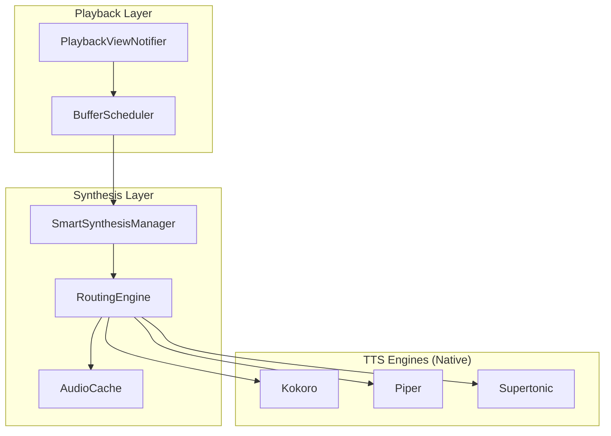
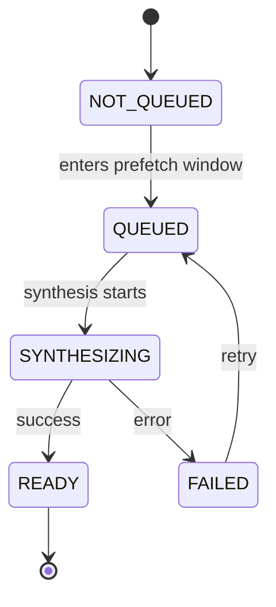
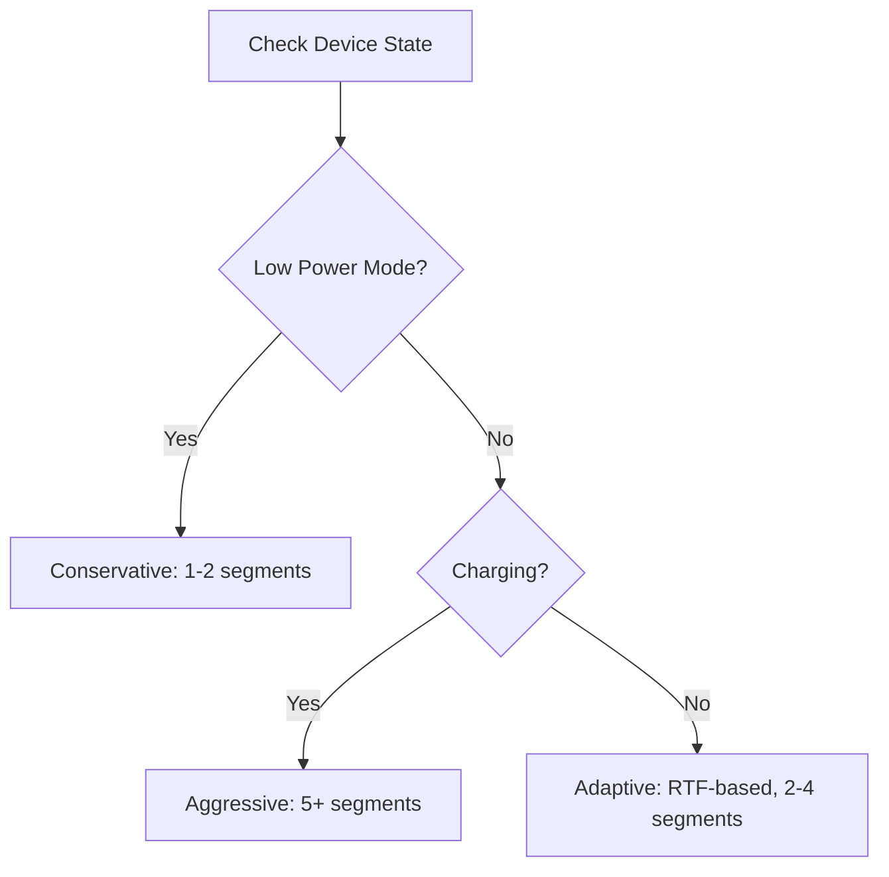

# Audio Synthesis Pipeline

> Transforms text segments into playable audio with intelligent prefetching.

## Overview

The synthesis pipeline:
1. Converts text segments to audio via on-device TTS engines
2. Caches synthesized audio for instant replay
3. Prefetches upcoming segments to eliminate playback gaps
4. Manages memory across Kokoro, Piper, and Supertonic engines

---

## Architecture



---

## Segment Lifecycle



| State | Description |
|-------|-------------|
| `NOT_QUEUED` | Beyond prefetch window |
| `QUEUED` | Waiting for synthesis slot |
| `SYNTHESIZING` | TTS engine processing |
| `READY` | Cached and playable |
| `FAILED` | Error (may retry) |

---

## Prefetch Strategy

### Three-Phase Prefetch

| Phase | Trigger | Target | Priority |
|-------|---------|--------|----------|
| **Cold-start** | `loadChapter()` | Segment 0 (blocking) + 1 (async) | Highest |
| **Immediate** | `playFile(n)` | Segment n+1 | High |
| **Background** | Buffer < 10s | Until 30s buffer | Normal |

### Strategy Selection



---

## Cache System

### Cache Key Structure
```
{engine}_{voice}_{rate}_{textHash}
Example: kokoro_af_1_00_a7f3b2c9d1e4f6a8.wav
```

- Rate is synthesis rate (always 1.0), NOT playback rate
- Playback rate adjusted in audio player
- Cache validated: file exists + length >= 44 bytes (WAV header)

### Cache Lookup Flow
```
synthesize(voiceId, text)
  → Generate cacheKey
  → cache.isReady(cacheKey)?
      YES → Return cached file (FAST PATH)
      NO  → Synthesize → cache.markUsed() → Return
```

---

## Engine Management

### Engine Routing
```dart
voiceId format: "{engine}_{voice}"
Examples: "kokoro_af", "piper_lessac", "supertonic_v1"
```

### Memory Budget

| Device RAM | Max Loaded | Strategy |
|------------|------------|----------|
| ≤ 4GB | 1 model | Unload on switch |
| 4-8GB | 2 models | LRU eviction |
| > 8GB | 3+ models | Full caching |

---

## Concurrency Control

### Native Layer (Kotlin)
```kotlin
// Each TTS service limits to 4 concurrent requests
private val synthesisSemaphore = Semaphore(4)

synthesize(request):
    if (!synthesisSemaphore.tryAcquire()) → return BUSY
    try { runInference(...) }
    finally { synthesisSemaphore.release() }
```

### Flutter Layer
- Sequential prefetch with cancellation checks
- Context change → abort all pending synthesis
- Cancel token propagated to native layer

---

## Error Handling

| Error | Cause | Recovery |
|-------|-------|----------|
| `modelMissing` | TTS not installed | Prompt download |
| `outOfMemory` | Engine memory exhausted | Unload models, retry |
| `inferenceFailed` | Model crashed | Retry or skip |
| `busy` | Semaphore full | Return error code |
| `cancelled` | User cancelled | Stop cleanly |

### Retry Logic
- Retryable: timeout, inference, busy
- Max retries: 1
- Non-retryable: missing model, corrupted, invalid input

---

## Configuration

| Parameter | Default | Description |
|-----------|---------|-------------|
| `lowWatermarkMs` | 10,000 | Start prefetch threshold |
| `bufferTargetMs` | 30,000 | Target buffer size |
| `maxPrefetchTracks` | 15 | Max batch size |
| `nativeSemaphoreLimit` | 4 | Concurrent native synthesis |
| `cacheBudgetMB` | 500 | Max cache size |

---

## Implementation Files

| File | Purpose |
|------|---------|
| `buffer_scheduler.dart` | Prefetch orchestration |
| `smart_synthesis_manager.dart` | Cold-start strategy |
| `routing_engine.dart` | Engine selection |
| `audio_cache.dart` | File caching |
| `playback_view_notifier.dart` | Playback state machine |
| `*TtsService.kt` | Native synthesis |
