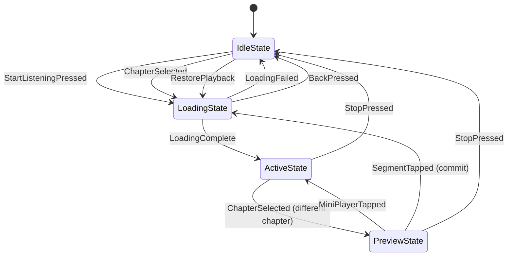

# Playback State Machine

> **Location:** `lib/app/playback/state/`

Pure function state machine for playback navigation. Separates state transitions from side effects.

## State Diagram



## States (Sealed Hierarchy)

```dart
sealed class PlaybackViewState
├── IdleState          // No active playback
├── LoadingState       // Transitioning to new content  
├── ActiveState        // User viewing & controlling current audio
└── PreviewState       // Browsing different content while audio plays
```

### State Definitions

| State | Description | UI Characteristics |
|-------|-------------|-------------------|
| **IdleState** | No audio loaded | No mini player, no controls, "Start Listening" available |
| **LoadingState** | Preparing audio | Loading indicator, previous audio continues, can cancel |
| **ActiveState** | Viewing current playback | Full controls, auto-scroll, position auto-saves (30s) |
| **PreviewState** | Browsing while audio plays | Mini player, tap to commit, no auto-scroll/save |

---

## Events (21 Types)

### User-Initiated Events
| Event | Description |
|-------|-------------|
| `StartListeningPressed` | Main button on Book Details |
| `ChapterSelected` | Tap chapter in list |
| `SegmentTapped` | Tap text segment (seek or commit) |
| `MiniPlayerTapped` | Return to active playback |
| `BackPressed` | Navigation back |
| `PlayPauseToggled` | Toggle playback |
| `StopPressed` | Stop and return to idle |
| `UserScrolled` | Manual scroll (disables auto-scroll) |
| `JumpToAudioPressed` | Re-enable auto-scroll |
| `SkipForward/SkipBackward` | Navigation |
| `SpeedChanged` | Playback rate change |
| `SleepTimerSet` | Set/cancel sleep timer |

### System Events
| Event | Description |
|-------|-------------|
| `LoadingComplete` | Chapter ready with segments |
| `LoadingFailed` | Load error |
| `PreviewSegmentsLoaded` | Preview content ready |
| `ChapterEnded` | Current chapter finished |
| `NoMorePlayableContent` | Book complete |
| `AudioError` | Playback error |
| `SegmentAdvanced` | Auto-advance to next segment |
| `PlaybackStateChanged` | External state change (audio service) |
| `AutoSaveTriggered` | 30-second save timer |
| `SleepTimerExpired` | Timer finished |
| `RestorePlayback` | App recovery |

---

## Transition Function

Pure function pattern: `(state, event) → (newState, [sideEffects])`

### Key Transitions

| Transition | Event | Side Effect |
|------------|-------|-------------|
| Idle → Loading | `StartListeningPressed` | `LoadChapter(autoPlay: true)` |
| Loading → Active | `LoadingComplete` | `StartPlayback` |
| Active → Preview | `ChapterSelected` (different chapter) | `LoadPreviewSegments` |
| Preview → Loading | `SegmentTapped` (commit) | `LoadChapter(autoPlay: true)` |
| Preview → Active | `MiniPlayerTapped` | Navigate to playing content |
| Any → Idle | `StopPressed` | `StopAudio` |

---

## Side Effects

Computed by transitions, executed by `PlaybackViewNotifier`:

| Side Effect | Action |
|------------|--------|
| `LoadChapter` | Fetch segments from DB, prepare synthesis |
| `StartPlayback` | Begin audio playback |
| `PlayAudio/PauseAudio` | Audio control |
| `SeekToSegment` | Jump to specific segment |
| `SavePosition` | Persist to SQLite |
| `MarkChapterComplete` | Update completed_chapters table |
| `MarkBookComplete` | Update reading_progress table |

---

## UI Derivation

Extension on `PlaybackViewState` derives all UI decisions:

| Property | IdleState | LoadingState | ActiveState | PreviewState |
|----------|-----------|--------------|-------------|--------------|
| `showMiniPlayerGlobally` | ❌ | ✅ | ✅ | ✅ |
| `showFullPlaybackControls` | ❌ | ❌ | ✅ | ❌ |
| `shouldAutoScroll` | ❌ | ❌ | ✅ | ❌ |
| `shouldAutoSavePosition` | ❌ | ❌ | ✅ | ❌ |
| `segmentTapSeeks` | - | - | ✅ (seek) | ❌ (commit) |

---

## SQLite Persistence

| Table | Purpose |
|-------|---------|
| `chapter_positions` | Per-chapter positions, `is_primary` marks resume point |
| `reading_progress` | Book progress, listening time |

---

## Files

| File | Purpose |
|------|---------|
| `playback_view_state.dart` | State definitions |
| `playback_event.dart` | Event definitions |
| `playback_state_machine.dart` | Pure transition function |
| `playback_side_effect.dart` | Side effect definitions |
