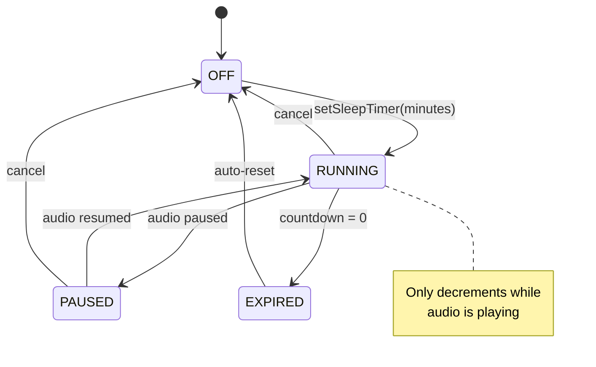

# Sleep Timer State Machine

Auto-pause playback after a set duration.

**Key behaviors:**
- Timer only counts down while audio is **actively playing**
- Timer **resets to full duration** on any user interaction
- Prevents timer expiry during pauses or buffering

## State Diagram

### State Definitions

| State | Condition | UI |
|-------|-----------|-----|
| **OFF** | `_sleepTimerMinutes == null` | Moon icon, no badge |
| **RUNNING** | Timer set, audio playing | Moon + countdown badge |
| **PAUSED** | Timer set, audio paused | Moon + frozen countdown |
| **EXPIRED** | Countdown = 0 | Shows 0:00 → OFF |

---

## User Actions That Reset Timer

| Action | Resets Timer |
|--------|--------------|
| Play/Pause toggle | ✅ Yes |
| Next/Previous segment | ✅ Yes |
| Next/Previous chapter (manual) | ✅ Yes |
| Auto-advance chapter | ❌ No |
| Seek to segment | ✅ Yes |
| Speed change | ✅ Yes |
| Set new timer duration | Resets to new value |

---

## Timer Options

Available durations: **Off**, **5 min**, **10 min**, **15 min**, **30 min**, **1 hour**

---

## Implementation

- Implemented in `PlaybackScreen` with local state
- Uses `Timer.periodic(1 second)` for countdown
- Checks `mounted` before `setState` to prevent crashes
- Checks `isPlaying` before decrementing (paused = frozen)

### On Expiration

1. Set remaining to 0
2. Call `playbackController.pause()`
3. Clear timer state (minutes = null, remaining = null)
4. Cancel timer instance
