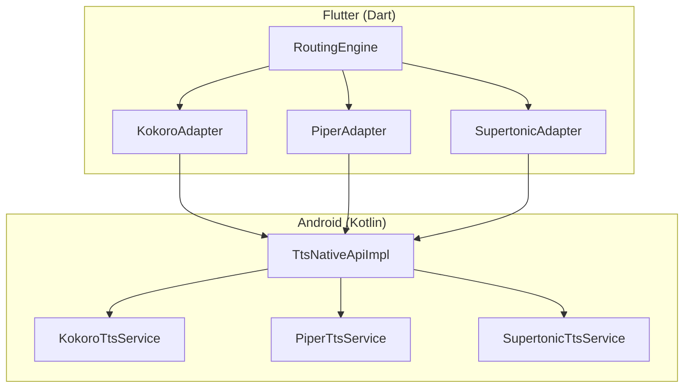
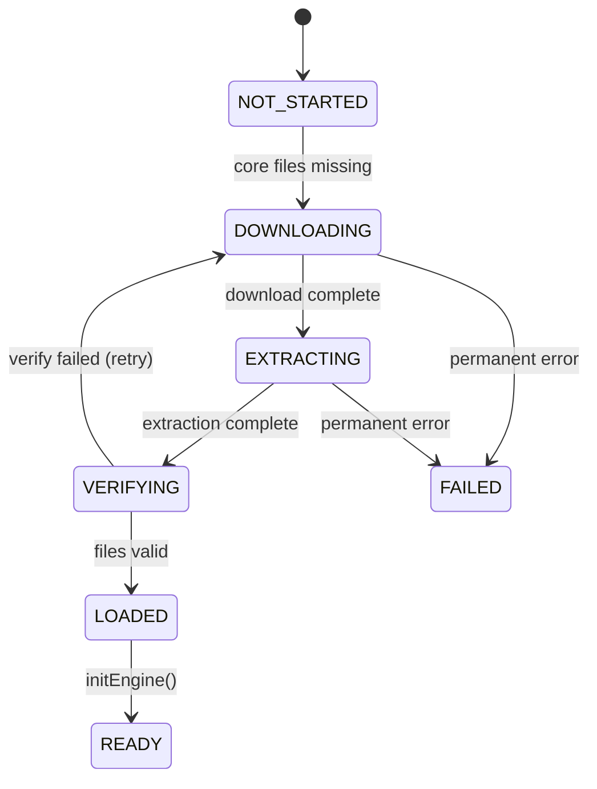
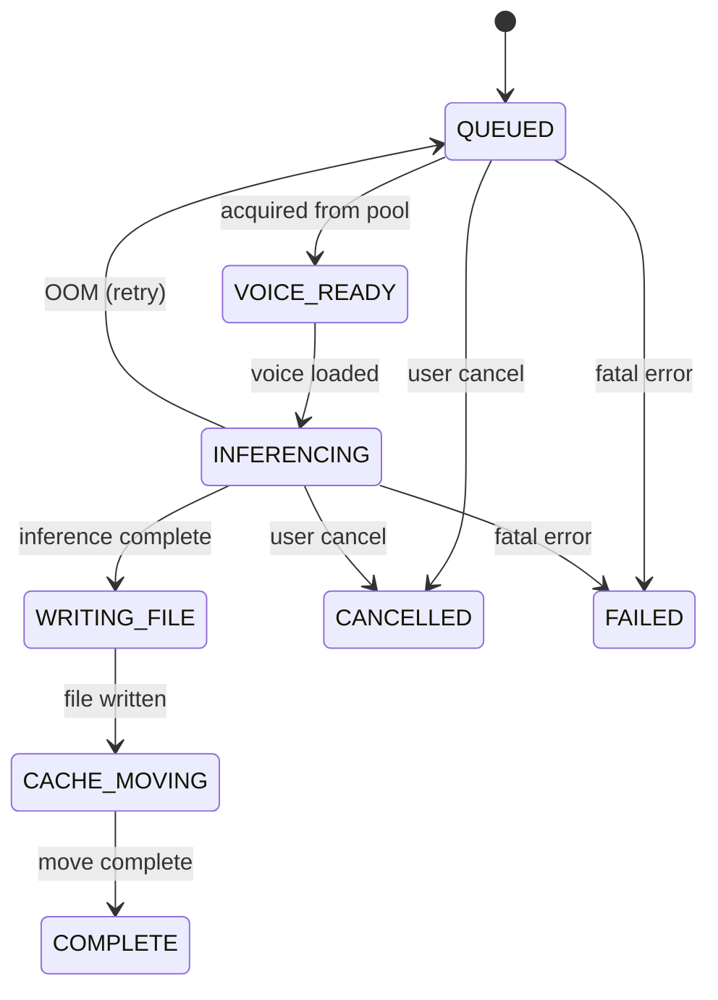

# TTS Synthesis State Machine

Multi-layered state machine for text-to-speech synthesis.

## Architecture Layers



---

## Core Readiness State Machine



| State | Description |
|-------|-------------|
| `notStarted` | No core files present |
| `downloading` | Downloading core model files |
| `extracting` | Extracting downloaded archive |
| `verifying` | Verifying file integrity |
| `loaded` | Files present, engine not initialized |
| `ready` | Engine initialized and ready |
| `failed` | Permanent failure - requires user action |

---

## Synthesis Lifecycle State Machine



| State | Description |
|-------|-------------|
| `queued` | Waiting in synthesis pool |
| `voiceReady` | Verifying voice is loaded |
| `inferencing` | Running TTS model inference |
| `writingFile` | Writing PCM samples to WAV |
| `cacheMoving` | Atomic rename to final path |
| `complete` | Synthesis succeeded |
| `failed` | Synthesis failed |
| `cancelled` | User cancelled request |

---

## Error Codes

| Code | Recoverable | Description |
|------|-------------|-------------|
| `modelMissing` | No | Model file not found |
| `modelCorrupted` | No | Model file corrupted |
| `inferenceFailed` | Maybe | Inference error |
| `outOfMemory` | Yes | OOM - unload LRU and retry |
| `busy` | Yes | Too many concurrent requests |
| `cancelled` | N/A | User cancellation |
| `invalidInput` | No | Empty/invalid text |
| `fileWriteError` | No | Failed to write output |

---

## Concurrency Control

Each TTS service limits to **4 concurrent requests** via semaphore:

```kotlin
private val synthesisSemaphore = Semaphore(4)

if (!synthesisSemaphore.tryAcquire()) {
    return SynthesisResult(success = false, errorCode = BUSY)
}
try { /* synthesis */ }
finally { synthesisSemaphore.release() }
```

Thread-safe data structures:
- `ConcurrentHashMap` for active jobs and loaded voices
- `@Volatile` for shared flags

---

## Memory Management

LRU-based model unloading on memory pressure:
1. Check `isSafeToLoadModel()` before loading
2. On OOM: Call `unloadLeastUsedVoice()` → retry
3. Track `lastUsed` timestamp on each voice
4. `SynthesisCounter` prevents unload during active synthesis

---

## File Operation Safety

Atomic file operations prevent corruption:

```kotlin
val tmpFile = File("$outputPath.tmp")
writeWavFile(tmpFile, pcmData, sampleRate)

// Atomic rename with fallback
if (!tmpFile.renameTo(finalFile)) {
    tmpFile.copyTo(finalFile, overwrite = true)
    tmpFile.delete()
}
```
